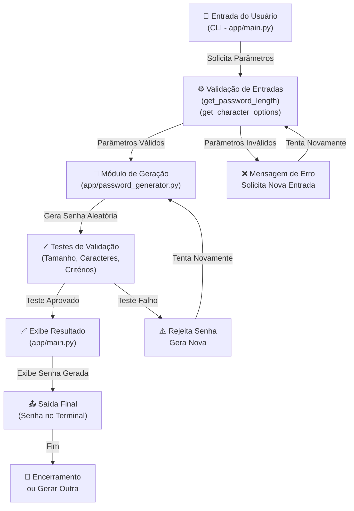
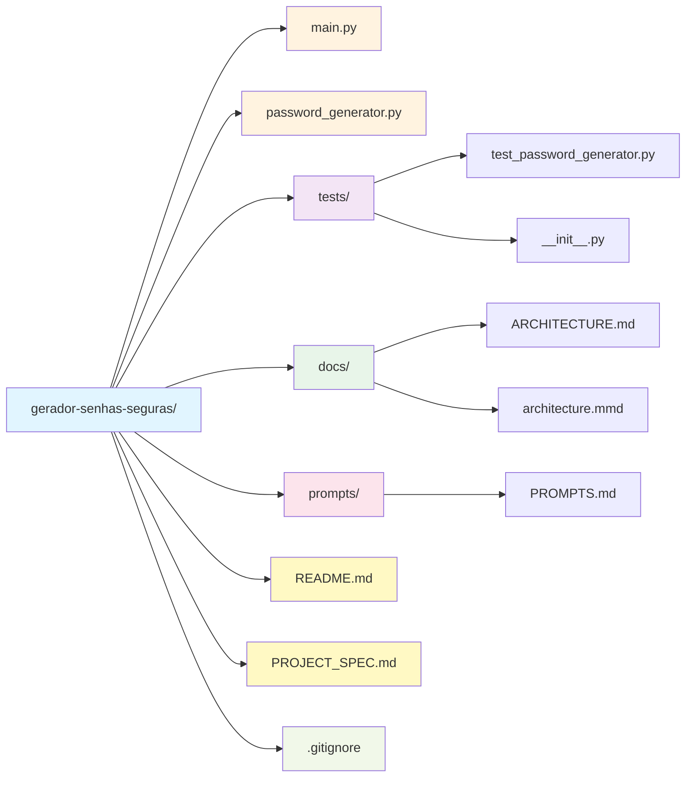
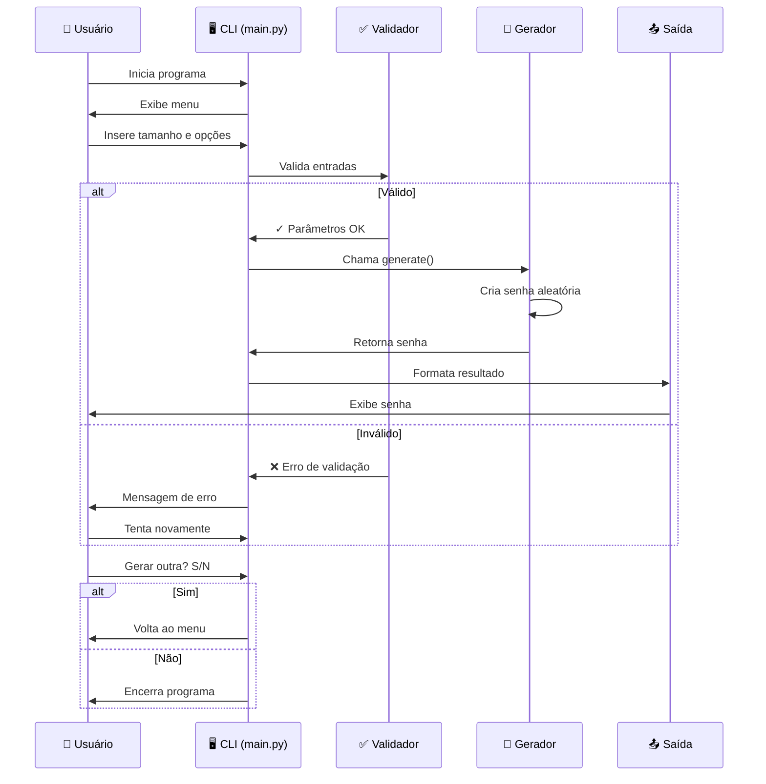
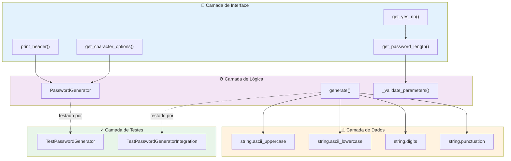
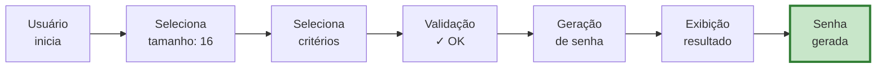
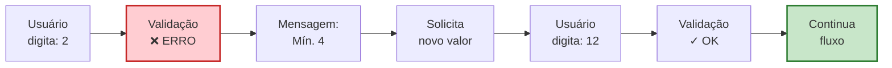
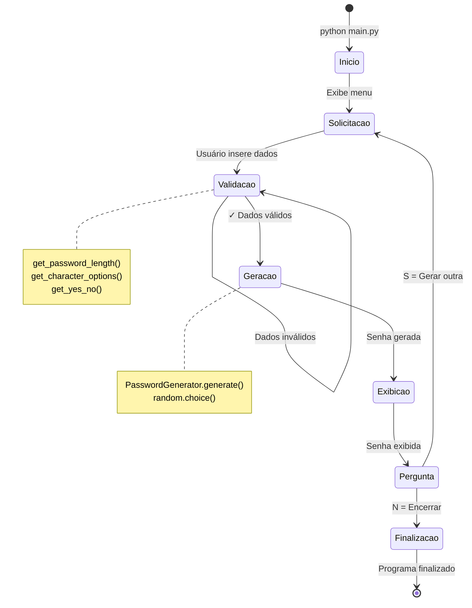

# Diagrama de Arquitetura - Gerador de Senhas Seguras

## Fluxo da Aplicação

---

## Componentes do Sistema

### 1️⃣ **CLI (app/main.py)**
- Interface com o usuário
- Coleta de parâmetros
- Exibição de resultados

### 2️⃣ **Validação de Entrada**
- `get_password_length()` → Valida tamanho (4-128)
- `get_character_options()` → Valida tipos de caracteres
- Mensagens de erro específicas

### 3️⃣ **Módulo de Geração (app/password_generator.py)**
- Classe `PasswordGenerator`
- Método `generate()` → Cria senha aleatória
- Critérios configuráveis
- Uso de `random` e `string`

### 4️⃣ **Testes**
- `tests/test_password_generator.py` → Testes unitários
- Cobertura de cenários de sucesso e erro
- 20+ testes implementados

### 5️⃣ **Saída Final**
- Exibição formatada da senha
- Informações dos critérios utilizados
- Opção de gerar nova senha

---

## Estrutura de Pastas

---

## Fluxo de Dados

---

## Camadas da Aplicação

---

## Cenários de Fluxo

### ✅ Cenário de Sucesso

### ❌ Cenário de Erro

---

## Ciclo de Vida da Aplicação

---

**Diagrama gerado em Markdown Mermaid**  
**Projeto:** Gerador de Senhas Seguras - MVP Acadêmico  
**Data:** 23 de Abril de 2026
